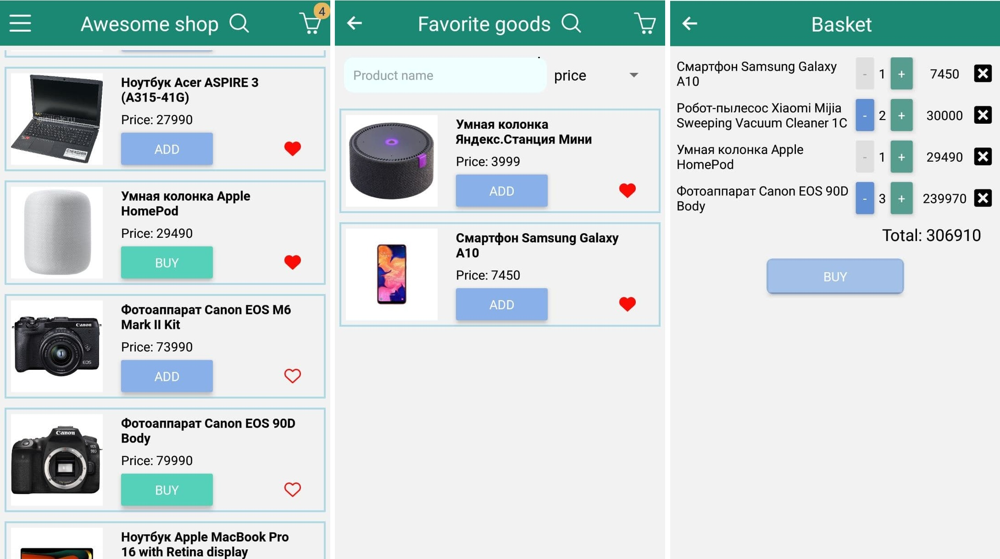

# React Native Shop

## Основные возможности приложения

- Просмотр списка товаров
- Добавление товаров в избранное
- Добавление товаров в корзину
- Сортировка товаров по названию/цене и поиск по названию
- Изменение количества или удаление товаров в корзине

## Стек технологий

- TypeScript
- React Native
- React Navigation
- React Hooks
- Redux (Toolkit, Query)
- Expo

## Запуск приложения

Для запуска приложения необходимо сделать следующее:

- Клонировать репозиторий

```js
git clone https://github.com/Alexkon30/native-shop
```

- Установить зависимости

```bash
npm i
```

- Запустить приложение

```bash
npm start
```

- Для просмотра понадобится симулятор устройств или Ваш мобильный телефон, с утановленным приложением [Expo](https://play.google.com/store/apps/details?id=host.exp.exponent&hl=ru&gl=US)

- После запуска приложения в Вашем браузере откроется страница с информацией о запущенном приложении.
  Данная страница предложит Вам запустить приложение в симуляторе.
  Также, в левом нижнем углу страницы Вы сможете найти QR-код, который нужно открыть через ранее установленное приложение Expo для тестирования на своем телефоне.

## Скриншоты приложения


